# Tutorial from A to Z


1. [setup-the-host-system](#setup-the-host-system)
2. [partition](#partition)


## Setup the host system.

To develop this `Linux from scratch` i need a Host system, i choose [ubuntu](https://ubuntu.com/download/desktop) desktop but you can do it with **any** linux distribution.

---

### Create the virtual machine following those steps :

> Im using `virtualbox-7.2_7.2.20` for `debian 13.6`.

<div align="center">
  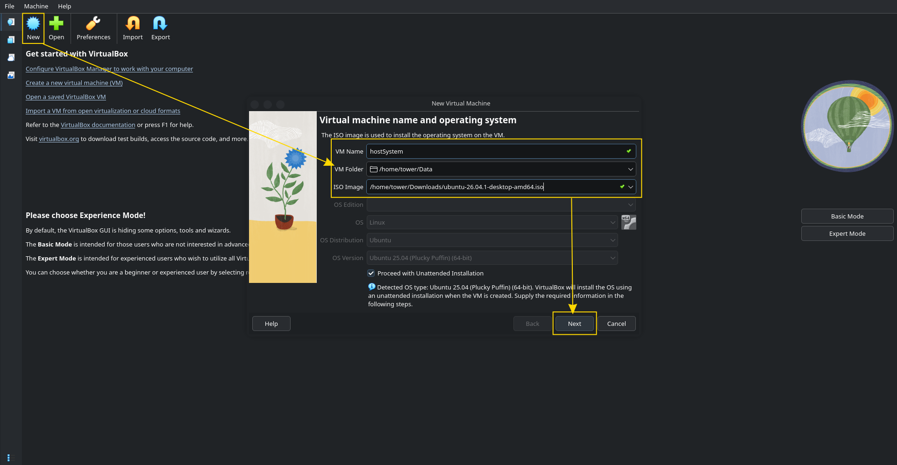
</div>

---

> Choose a easy password you will remember.

<div align="center">
  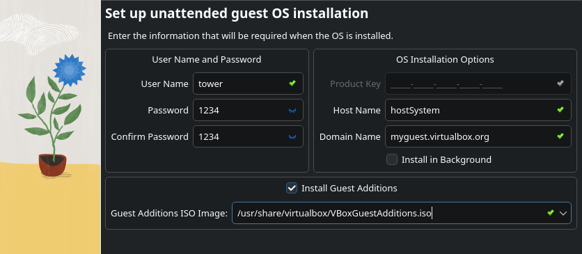
</div>

---

> Choose (RAM / CPU / DISK) in function of your computer.

<div align="center">
  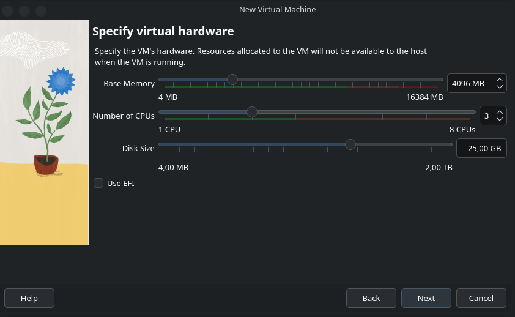
</div>

---

> Let it load Ubuntu.

<div align="center">
  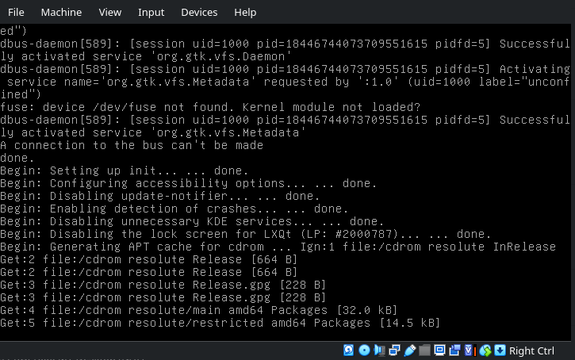
</div>

---

> Those settings are up to you.

<div align="center">
  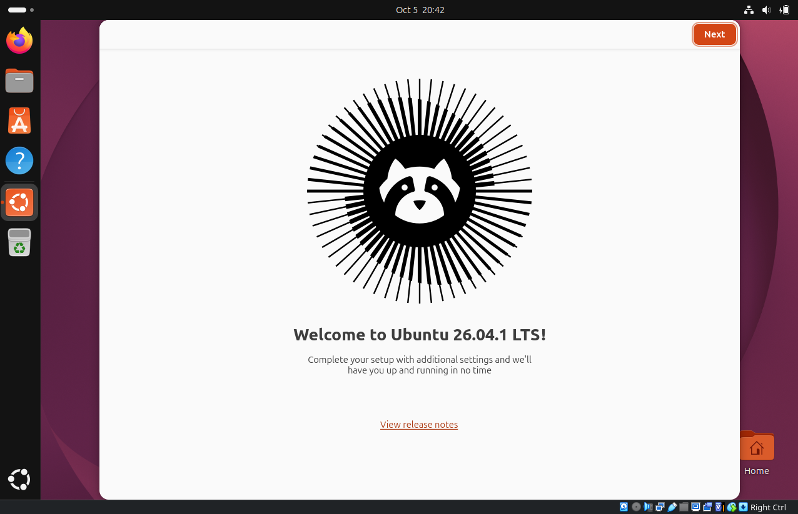
</div>

---

> Finally the host system is up and functional.

<div align="center">
  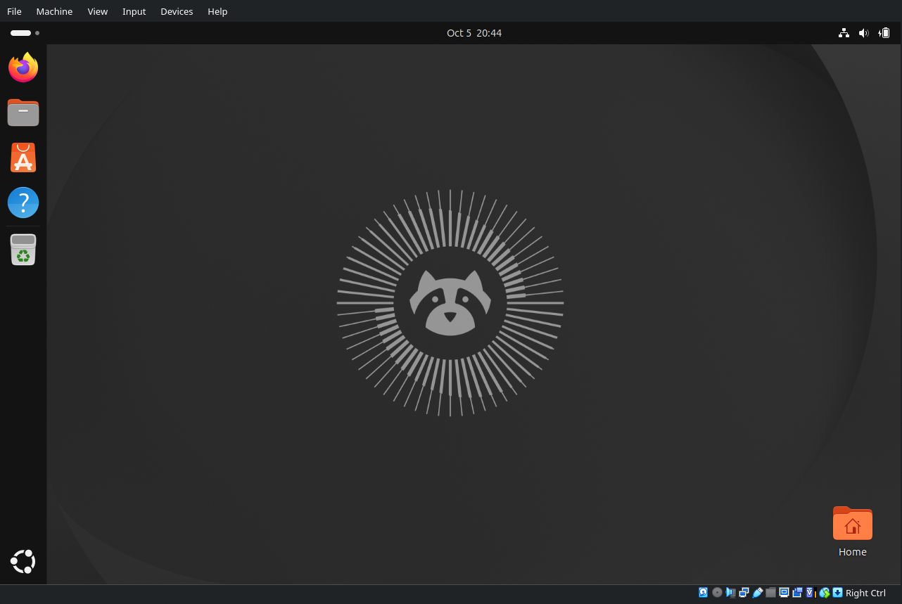
</div>

---

---

> Let save this part with a snapshot `otherwhise on the machine : Host + T`

<div align="center">
  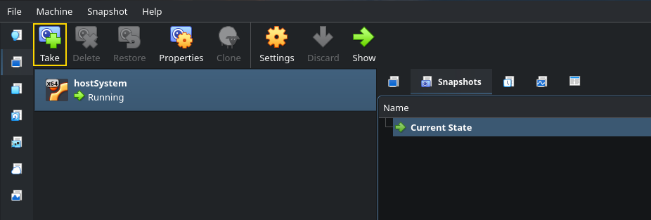
</div>

---

## Partition

[Chapter02 : Creating Partition](https://www.linuxfromscratch.org/lfs/view/stable/chapter02/creatingpartition.html)

Creating the partitions is often done with two main tools : [cfdisk](https://fr.wikipedia.org/wiki/Cfdisk) and [fdisk](https://fr.wikipedia.org/wiki/Fdisk), the main difference beetween them is graphical.

> [!NOTE]
> In my case i will use `Fdisk`.

Here you can find the [Fdisk man](https://man.archlinux.org/man/fdisk.8.en).

The first parameter i used is `-l`, this will **list all partitions** already on your **host system**.
```shell
sudo fdisk -l # you can try this without risk on your personal laptop for education purpose.
```

> You will see many `/dev/loopX`, those are packages mounted like virtual disk by linux to use them without decompressing them.
<div align="center">
  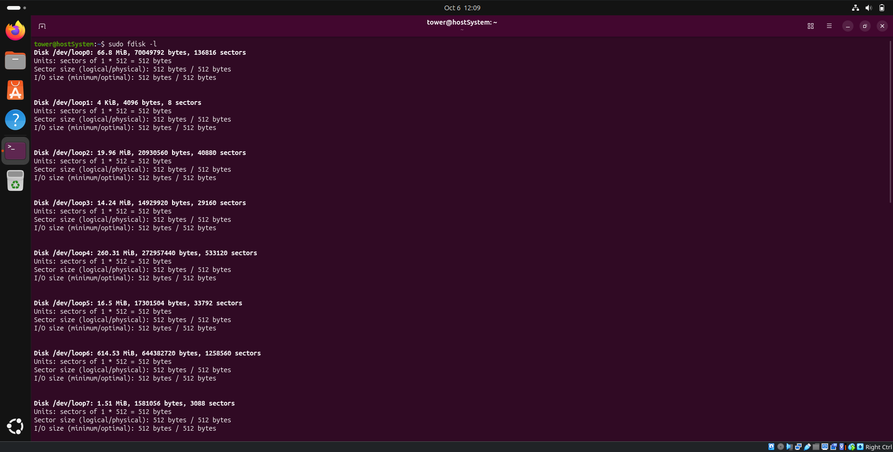
</div>

> This is the interesting part, you will see two partitions made on the virtual disk.
- `/dev/sda1` of 1MB is the partition needed to host the boot.
- `/dev/sda2` of 25GB is the partition for the root directory (where all will be stocked).
<div align="center">
  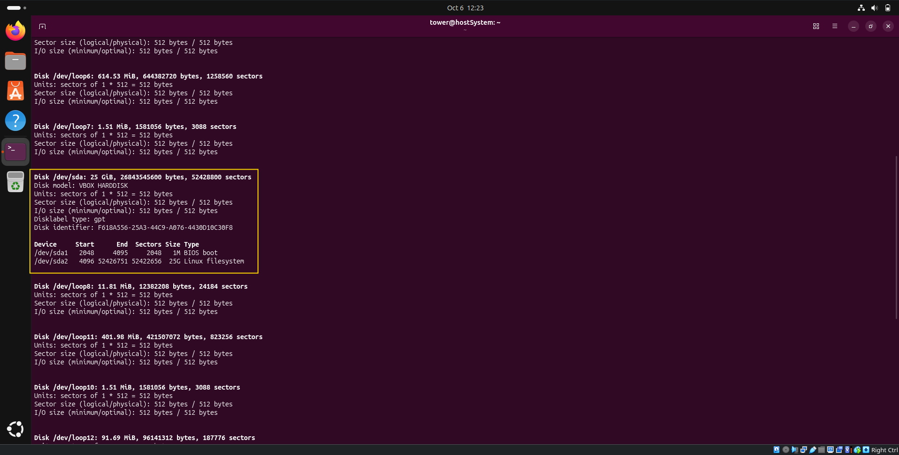
</div>

The next step will be to create our personal partitions for our distribution. 

> [!WARNING]
> Constraints 
> You must use at least 3 different partitions: root, /boot and a swap partition. You
> can, of course, make more partitions if you want to.
```

### Partitions Explanation

- **root** - *35go* : This will contain all the linux file system, this is the only mandatory partition for linux to work. (common format : ext4, btrfs, xfs)
- **/boot** - *1go* : Contain all the files necessary for starting the system. Nowadays the main reasons to separate it from root is to load the program who ask the disk password if the root partition is encrypted, and if you use complex storage like RAID for servers  
- **swap** - *4go* : This partition is not a naviguable memory but will act like an extension of your RAM on the disk. The RAM in case of overflow will move temporary inactive data into this partition to avoid the system to freeze. In case of system hibernation it can also move all the RAM content into it, so the system at the awakening will load it in the RAM from this partition.

---

To create the partition i used [this](https://doc.ubuntu-fr.org/fdisk) tutorial explaning with fdisk utilities.

To facilitate the export of my LFS and the developpement practicity, i will create a new virtual disk attached to my host system.

<div align="center">
  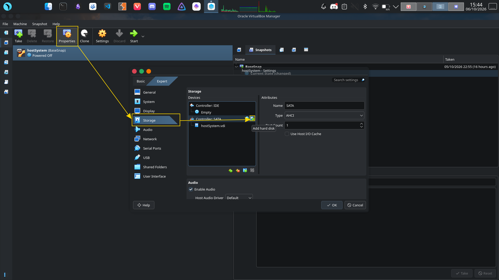
</div>

<div align="center">
  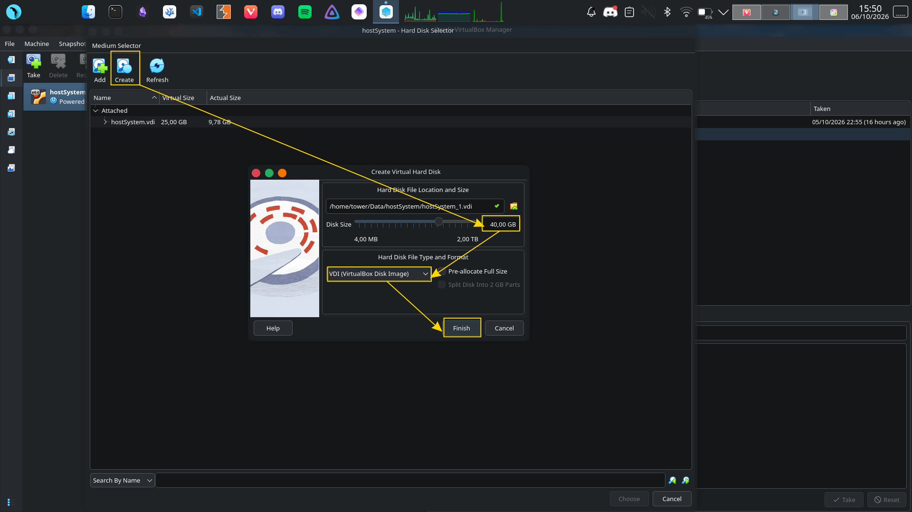
</div>


```shell
free -h # take a look at the swap partition
```