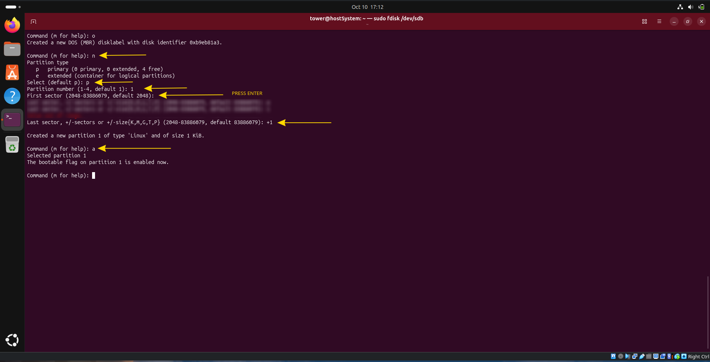
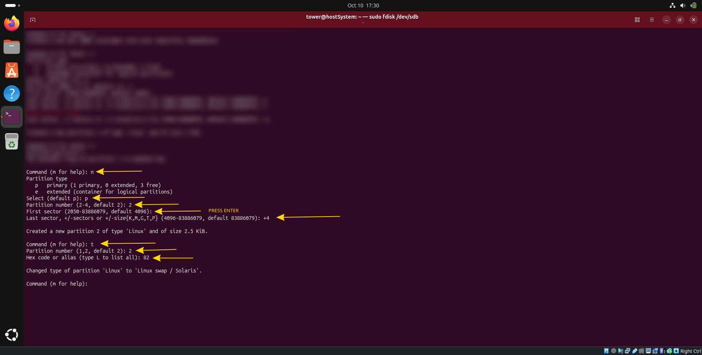
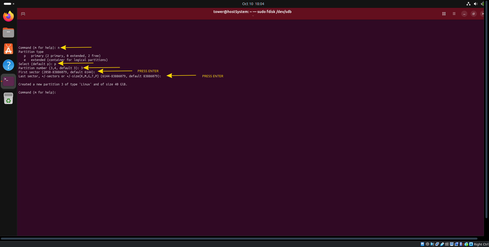

# Tutorial from A to Z


1. [system host creation](./hostcreation.md)
2. [partition](#partition)
3. [Creating a file system](#creating-a-file-system) 


<br>
<br>
<br>

# System host creation

> [!CAUTION]
> You have to follow the [system host creation](./hostcreation.md) described in another **.md** before continuing 

## Partition

[Chapter02 : Creating Partition](https://www.linuxfromscratch.org/lfs/view/stable/chapter02/creatingpartition.html)

Creating the partitions is often done with two main tools : [cfdisk](https://fr.wikipedia.org/wiki/Cfdisk) and [fdisk](https://fr.wikipedia.org/wiki/Fdisk), the main difference beetween them is graphical.

> [!NOTE]
> In my case i will use `Fdisk`.

Here you can find the [Fdisk man](https://man.archlinux.org/man/fdisk.8.en).

The first parameter i used is `-l`, this will **list all partitions** already on your **host system**.
```shell
sudo fdisk -l # you can try this without risk on your personal laptop for education purpose.
```

> You will see many `/dev/loopX`, those are packages mounted like virtual disk by linux to use them without decompressing them.
<div align="center">
  
</div>

> This is the interesting part, you will see two partitions made on the virtual disk.
- `/dev/sda1` of 1MB is the partition needed to host the boot.
- `/dev/sda2` of 25GB is the partition for the root directory (where all will be stocked).
<div align="center">
  
</div>

The next step will be to create our personal partitions for our distribution. 

> [!CAUTION]
> School subject :  
> You must use at least 3 different partitions: root, /boot and a swap partition. You
> can, of course, make more partitions if you want to.


### Partitions Explanation

> [!WARNING]
> You have the choice for the size of each partition, but you have to refer to the tutorial to see the minimum required

- **root** - *35go* : This will contain all the linux file system, this is the only mandatory partition for linux to work. (common format : ext4, btrfs, xfs)
- **/boot** - *1go* : Contain all the files necessary for starting the system. Nowadays the main reasons to separate it from root is to load the program who ask the disk password if the root partition is encrypted, and if you use complex storage like RAID for servers  
- **swap** - *4go* : This partition is not a naviguable memory but will act like an extension of your RAM on the disk. The RAM in case of overflow will move temporary inactive data into this partition to avoid the system to freeze. In case of system hibernation it can also move all the RAM content into it, so the system at the awakening will load it in the RAM from this partition.

---

To facilitate the export of my LFS and the developpement practicity, i will create a new virtual disk attached to my host system.

<div align="center">
  
</div>

<div align="center">
  
</div>

Finally we can create partitions, i used [this](https://doc.ubuntu-fr.org/fdisk) tutorial explaning how to use fdisk utilities.

List all partitions with `sudo fdisk -l` 

> [!CAUTION]
> our new virtual disk must be /dev/sdb but it is possible to have another name if you have already more vdisk, in my tutorial i will assume you have `sdb` but adapt it to your case.

<div align="center">
  
</div>

Next step is to enter edit mode with `fdisk` using ```sudo fdisk /dev/sdb```

To be secure with my new virtual disk the first thing i do is just `o` it will 
create a new fresh [MBR DOS table.](https://en.wikipedia.org/wiki/Master_boot_record)
<div align="center">
  
</div>

### Creating /boot partition

> [!WARNING]
> On my screenshots i forgot to add the `G` after end size sector
> Ex: +1G

```bash
# in fdisk console
n -> new partition
p -> primary partition
1 -> first partition
ENTER -> default first sector
+1G -> 1go Partition
a -> make the partition bootable
```
<div align="center">
  
</div>

### Creating swap partition

> [!WARNING]
> On my screenshots i forgot to add the `G` after end size sector
> Ex: +4G

```bash
# in fdisk console
n -> new partition
p -> primary partition
2 -> second partition
ENTER -> default first sector
+4G -> 1go Partition

t -> change type of partition
2 -> second partition
82 -> linux swap hex code
```
<div align="center">
  
</div>

### Creating root partition

```bash
# in fdisk console
n -> new partition
p -> primary partition
3 -> third partition
ENTER -> default first sector
ENTER -> fill the rest of vdisk
```
<div align="center">
  
</div>

### Finishing

to clean escape from fdisk console enter `w`

### Formating

```
# Formatage du /boot (l'ext4 est parfait, ou ext2 si le manuel le précise)
sudo mkfs -v -t ext4 /dev/sdb1

# Initialisation du Swap
sudo mkswap /dev/sdb2

# Formatage de la racine /
sudo mkfs -v -t ext4 /dev/sdb3
```

## Creating a file system 

[Creating a file system](https://www.linuxfromscratch.org/lfs/view/stable/chapter02/creatingfilesystem.html)

[Comparison_of_file_systems](https://en.wikipedia.org/wiki/Comparison_of_file_systems)

## Setting LFS variable and umask

[LFS/UMASK](https://www.linuxfromscratch.org/lfs/view/stable/chapter02/aboutlfs.html)

```shell
free -h # take a look at the swap partition
```